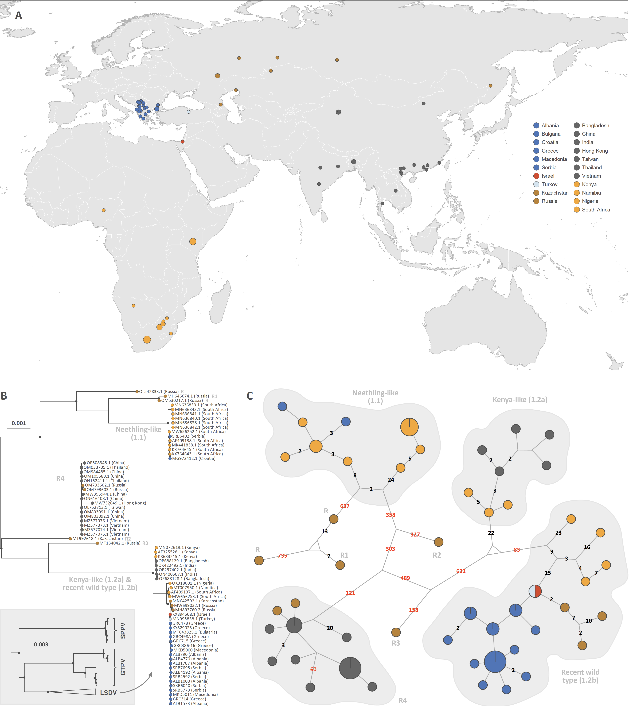

This repo gathers the input files and scripts related to our study entitled "**Complete genome reconstruction of the global and European regional dispersal history of the lumpy skin disease virus**" ([Van Borm\*, Dellicour\* *et al*. 2024](https://journals.asm.org/doi/10.1128/jvi.01394-23), *Journal of Virology*). R scripts related to the analyses are all gathered within the file `R_script_for_LSDV_study.r`.

Abstract: Lumpy skin disease virus (LSDV) causes a disease of economic importance affecting cattle. Its global epidemiology is complex due to the combination of vector-borne and anthropogenic spread, the circulation of vaccine-like recombinants, and the use of vaccines. The slow molecular evolution of its DNA genome limits the utility of genetic variation for accurate tracing based on evolutionary analyses, but this limitation has not yet been formally assessed. Furthermore, until present, whole genome sequencing in affected areas has remained patchy. This study combines the first fine-grained sampling of LSDV whole genomes from a time-constrained (2015–2017) southeastern European (SEE) LSDV outbreak, which we analyze along with curated public genomes to investigate the global and regional viral dispersal dynamics. First, haplotype networks visualizing the limited genetic variability associated with the SEE LSDV outbreak show intense intermixing between countries. We also assess at which spatial scale a correlation between genetic and geographic distances can be detected for LSDV. On a global scale, we show the importance of accounting for recombination events that can impact phylogenetic and phylogeographic reconstructions. Following the assessment of the temporal signal in the recombination-free alignment, our time-scaled continuous phylogeographic analysis of Kenya-like and recent wild-type viruses confirms the origin and global dissemination history of LSDV. Our analyses highlight the importance of careful selection and application of phylodynamic approaches to DNA viruses, as well as the importance of whole genome sampling in endemic and outbreak areas to improve our understanding of the evolution, epidemiology, and transmission dynamics of DNA viruses.

**Figure: sampling map and genetic variability of LSVD genomes.** (**A**) Sampling map. (**B**) ML phylogenetic tree based on the entire alignment for which the internal nodes are highlighted only when the associated bootstraps support is higher than 70% (see Figure 2 for a comparison with the ML tree based on the recombination-free alignment). (**C**) Haplotype network based on the entire alignment. In the network, each haplotype corresponds to a unique sequence represented by a circle, the size of which is proportional to its overall sampling frequency, and the genetic relatedness between haplotypes is represented by line segments. If more than one mutational change separates two haplotypes, a number indicates the number of mutations (see Figure 2 for the haplotype network focused on the southeastern European clade).